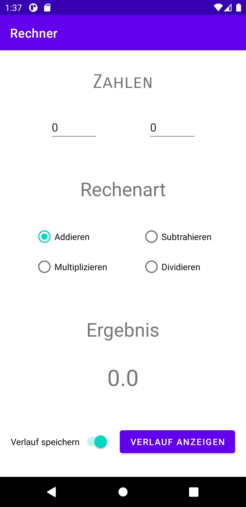
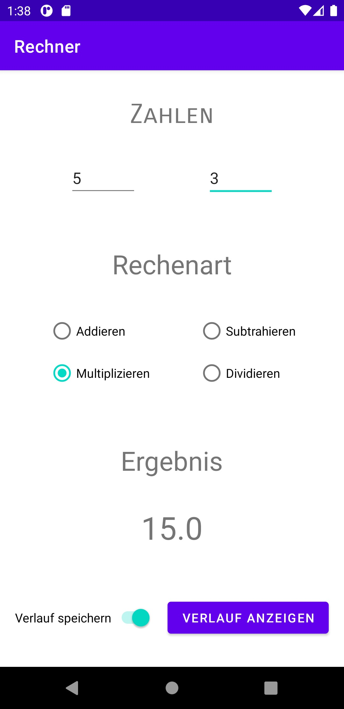
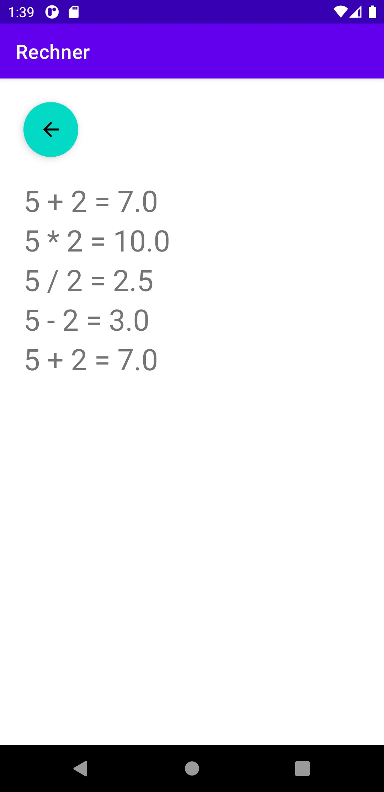

# Rechner
## Beschreibung und Funktionalität
Dieser Rechner bietet eine sehr primitive Implementierung der vier Grundrechenarten. Unterstützt werden sowohl positive und negative Zahlen als auch Ganz- und Kommazahlen.
Darüber hinaus verfügt der Rechner über einen eingebauten Verlauf, mit dem vorherige Rechnungen angesehen werden können. Auf Wunsch kann diese Funktionalität auch ausgeschalten werden.

Im Gegensatz zu den Anforderungen wird das Ergebnis nicht bei jeder gültigen Eingabe berechnet. Dies hat den Grund, dass der Verlauf sonst mit Ergebnissen regelrecht überflutet werden würde, obwohl die Rechnung nicht bewusst ausgeführt wurde. So würden beim Eingeben einer fünfstelligen Zahl auch fünf Verlaufseinträge erstellt werden, und das für Rechnungen, die vom Benutzer eigentlich gar nicht gewollt waren.
Das Ergebnis wird deshalb abgesehen von Änderungen der Operation nur neu berechnet, wenn der Benutzer die Zahl im Eingabefeld mit der eigens vorgesehenen Taste bestätigt.

## Lösungsansatz
Das Layout und die Logik des Rechners sind simpel gehalten: In den oberen beiden Textfeldern können zwei beliebige Zahlen eingegeben werden. Bei Bestätigung oder Auswahl einer Rechenoperation wird die gewählte Operation durchgeführt und das Ergebnis groß angezeigt.
Am unteren Ende des Bildschirmes befinden sich noch zwei Elemente nebeneinander, mit denen man den Verlauf kontrollieren kann. Der Schalter links schaltet die Aufzeichnung des Verlaufes ein oder aus. Mit dem Knopf rechts wird eine neue Aktivität mit dem Verlauf geöffnet. Diese Aktivität enthält einen Knopf um wieder zum Rechner zurückzukehren und eine Liste der durchgeführten Rechnungen. Sollte die Länge der Liste die Länge des Bildschirmes überschreiten, erscheint ein Scroll-Balken, der es ermöglicht, alle Ergebnisse anzusehen.

## Screenshots
Der Hauptbildschirm sieht folgendermaßen aus:  

Nach durchgeführter Rechnung sieht der Bildschirm z.B. so aus:  

Der Verlauf-Bildschirm sieht dann z.B. so aus:  

